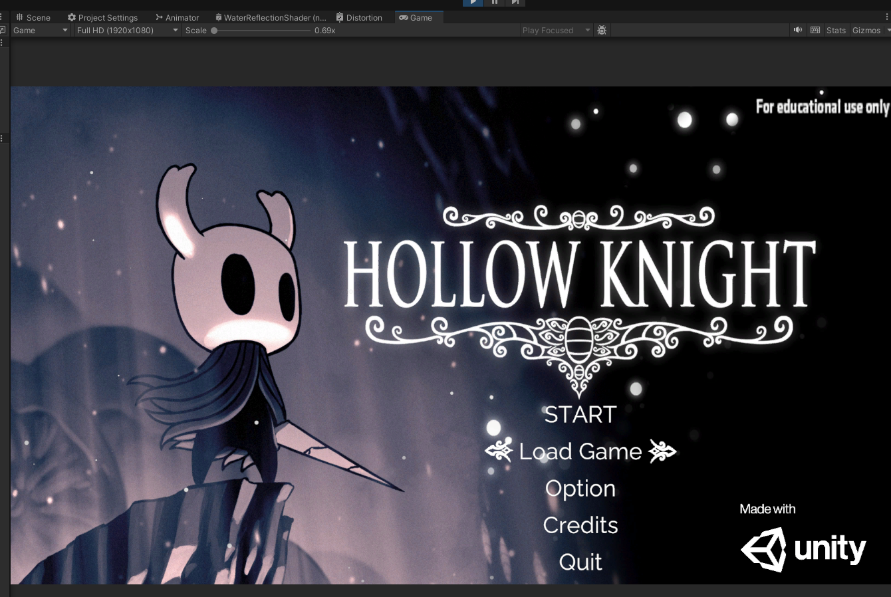
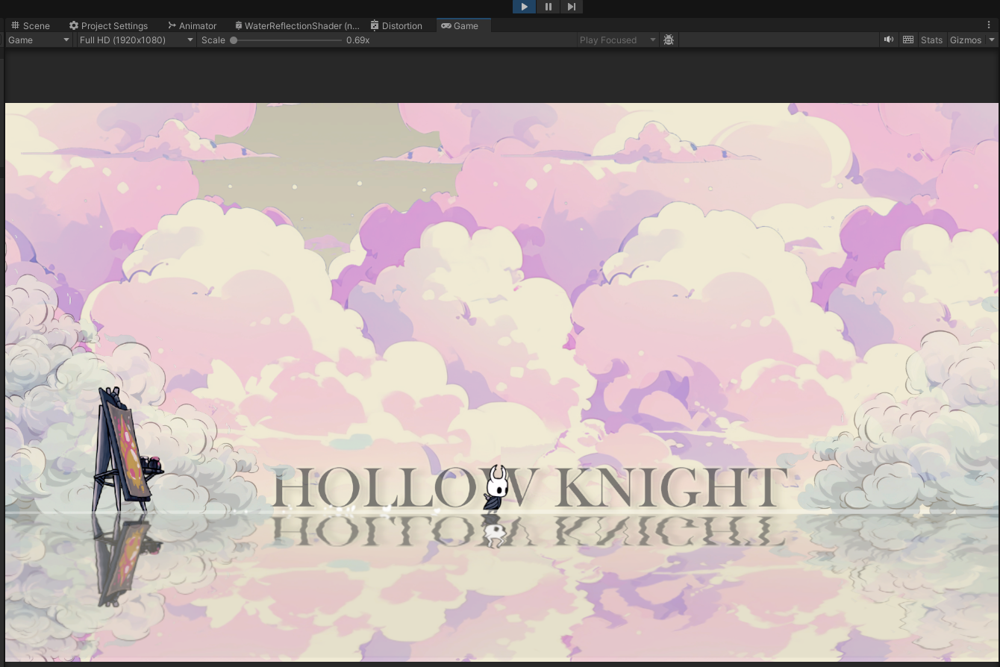
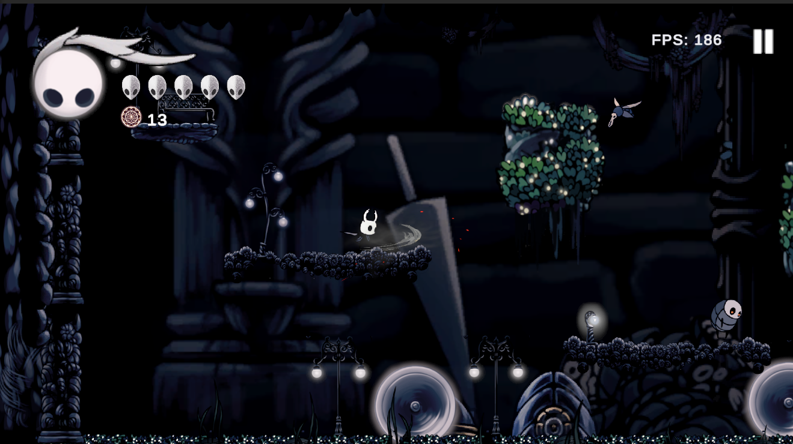
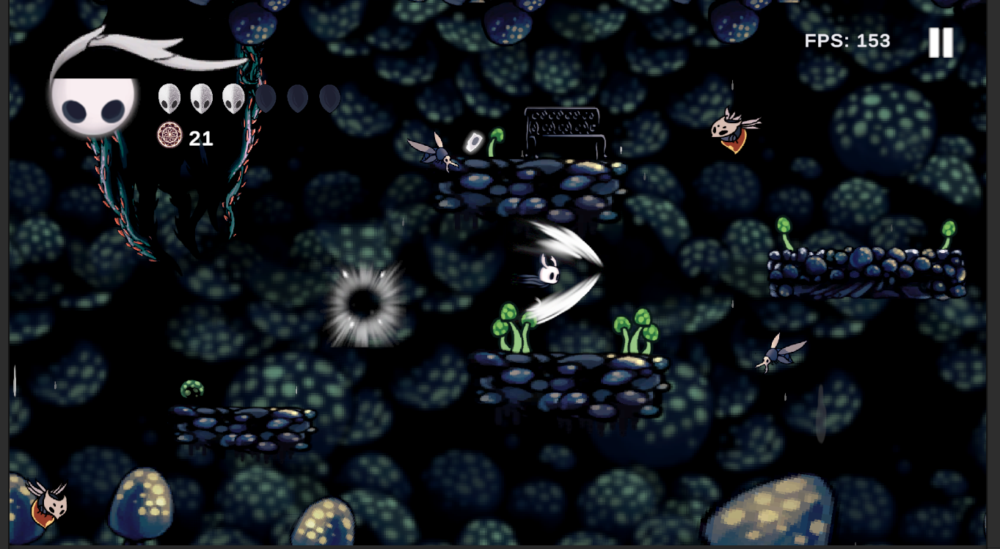
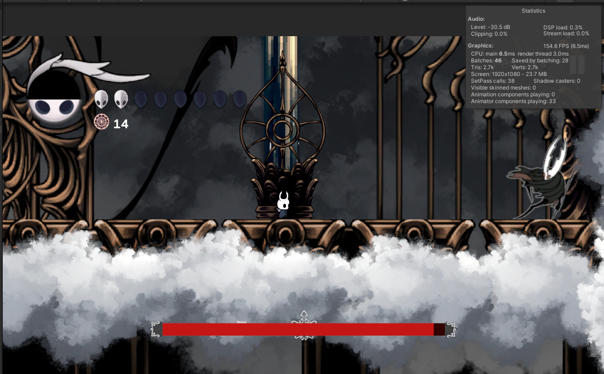
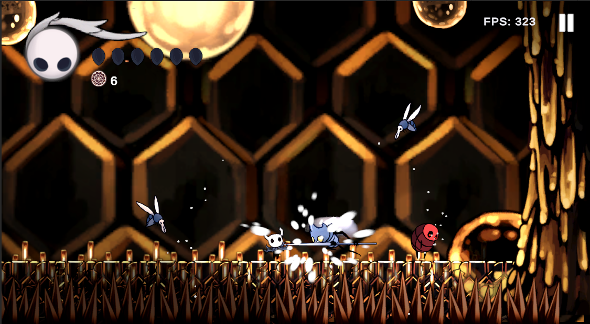
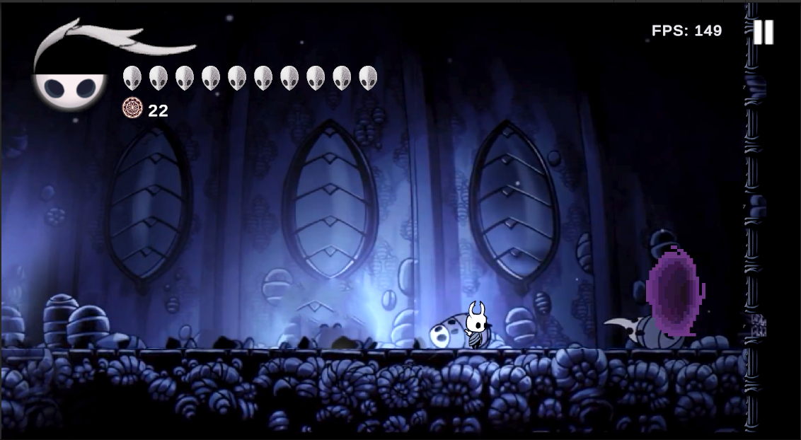
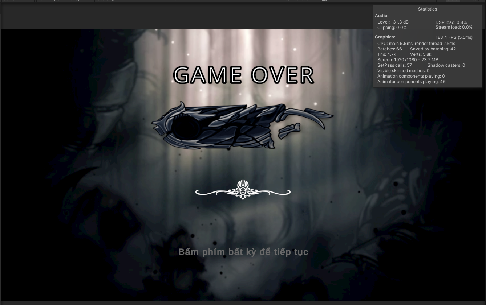

# Project_2D_Game_Platform_HN
WORK IN PROGRESS

This is a learning project where I am developing a 2D platformer and action-adventure game inspired by *Hollow Knight*, built using Unity. The project serves as a hands-on experience to explore game development concepts such as level design, AI behavior, and sprite integration, animation and more.

The game is currently in development, and this repository contains the project files and assets.
-------------
### Features
- Gameplay Mechanic:
  - 2D platformer mechanics including movement, jumping, and dashing.
  - Basic combat system
  - Level design that encourages exploration and discovery.
- AI-controlled enemies with custom behaviors such as roaming, attacking, chasing.
- Player health, mana, and ability system that unlock as the game progress.
- Map and enviroment inspired by Hollow Knight.
- Basic Audio design: dynamic background music for different levels.
-------------
### Technologies & Tool used
- Unity LTS version 6000.2.6f2.
- C#: Programming language for gameplay mechanics.
- Aseprite: Sprite design and animation.
- Adobe Photoshop: Image editing and asset creation.
- Git: Version control system.
-------------
### Ingame Screenshots
- **Main Menu UI**

- **Tutorial Scene**

- **Map 1**

- **Map 2**

- **Map 3**

- **Map 4**

- **Map 5**

- **GameOver Scene**

-------------
### Future Plans & Updates
- **Combat:** Add talismans, unique skills/spells, and smoother combo/block/counter flow.
- **Levels:** Redesign stages with unique challenges and more interactive elements (e.g., destructible objects).
- **Enemy AI:** Add new enemy types and smarter behaviors to make combat more strategic.
- **Boss Fights:** Build Hollow Knight-inspired bosses with stronger AI and richer mechanics.
- **UI/UX:** Expand settings (controls, language, audio, graphics) and redesign HUD for clarity.
- **Audio:** Improve BGM, SFX, and ambient sound layering for better immersion.
- **Optimization:** Boost low-end performance, reduce build size, and apply patterns like Object Pooling, Observer, and Command.
-------------
### How to Play
- **Clone:**
  - Clone this repository:
    ```
    git clone https://github.com/TriItMyName/Project_2D_Game_Platform_HN.git
    ```
  - Open project in Unity LTS 6000.2.62f.
  - Press Play in Unity Editor
-------------
### Resources
For those interested in *Hollow Knight* sprites, you can find resources below:  
- **Hollow Knight Sprites (Voidheart Edition) 1.4.3.2:** [Google Drive Link](https://drive.google.com/drive/folders/1lx02_w9TFTYdR3aggI1gbXcLr69roaNV)  
- **Other Sprite Resources:** [Spriters-Resource](https://www.spriters-resource.com/pc_computer/hollowknight/)
